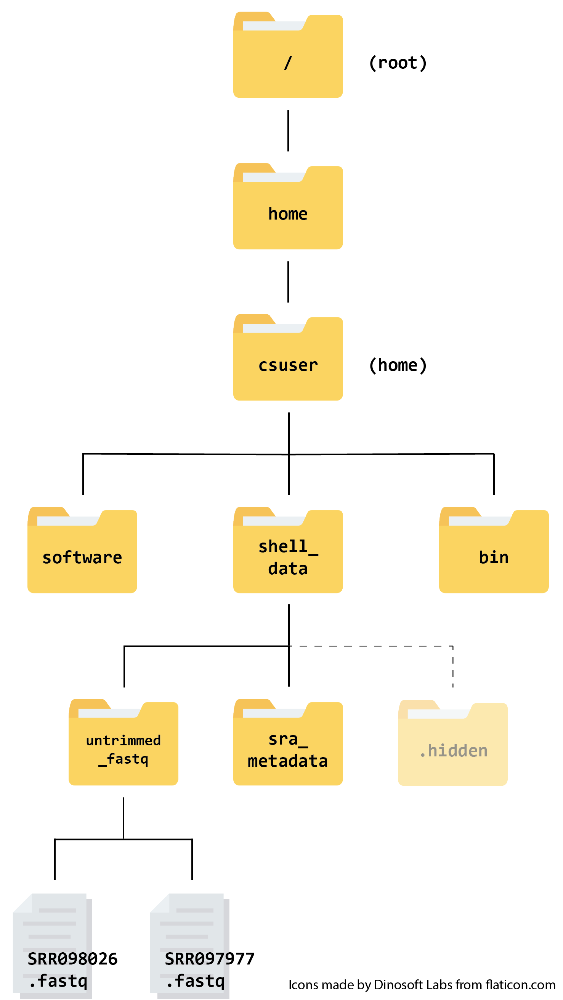

## Getting started

The first thing we need to do is log in to our cloud instance.

1. **Open the *cloudspan* folder you created for the course**

    Open your file manager and navigate to the `cloudspan` folder (hint: we recommended you make the folder in your *Desktop* directory - but you might have made it somewhere else). If you cannot find the folder, you can remind yourself where it is stored by looking at the absolute path you wrote down in the previous episode.

    The folder should contain the login key file we downloaded in the previous episode and nothing else.

2. **Right-click and open your machine's command line interface**

    Now we can open the command line.

    For Windows users:

    - Right click anywhere inside the blank space of the file manager, then select **Git Bash Here**.
  
    For Mac users:

    You have two options. 
    
    EITHER
    - Open **Terminal** in one window and type `cd` followed by a space. Do not press enter! Now open **Finder** in another window. Drag and drop the `cloudspan` folder from the Finder to the Terminal. You should see the file path leading to your `cloudspan` folder appear. Now press enter to navigate to the folder.

    OR
    - Open **Terminal** and type `cd` followed by the absolute path that leads to your `cloudspan` folder. Press enter. 
    
3. **Login into your instance**

    ~~~
    $ ssh -i login-key-instanceNNN.pem  csuser@instanceNNN.cloud-span.aws.york.ac.uk
    ~~~
    {: .bash}

  *Be sure to replace NNN with your own number, twice.*

## Reminder: our file structure

Before we start, here's a reminder of what our file structure looks like as a hierarchy tree:
{:width="400px"}. Keep this in mind as we continue to navigate the file system, and don't hesitate to refer back to it if needed.

## Examining the contents of other directories

In the previous session we learned how to use `pwd` to find our current location within our file system.
We also learned how to use `cd` to change locations and `ls` to list the contents
of a directory.

By default, the `ls` commands lists the contents of the working
directory (i.e. the directory you are in). You can always find the
directory you are in using the `pwd` command. However, you can also
give `ls` the names of other directories to view. Navigate to your
home directory if you are not already there.

~~~
$ cd
~~~
{: .bash}

Then enter the command:

~~~
$ ls shell_data
~~~
{: .bash}

~~~
sra_metadata  untrimmed_fastq
~~~
{: .output}

This will list the contents of the `shell_data` directory without
you needing to navigate there.

The `cd` command works in a similar way.

Try entering:

~~~
$ cd
$ cd shell_data/untrimmed_fastq
~~~
{: .bash}

This will take you to the `untrimmed_fastq` directory without having to go through
the intermediate directory.

> ## Navigating practice
>
> Navigate to your home directory. From there, list the contents of the `untrimmed_fastq`
> directory.
>
> > ## Solution
> >
> > ~~~
> > $ cd
> > $ ls shell_data/untrimmed_fastq/
> > ~~~
> > {: .bash}
> >
> > ~~~
> > SRR097977.fastq  SRR098026.fastq
> > ~~~
> > {: .output}
> >
> {: .solution}
{: .challenge}

## Full vs. Relative Paths

The `cd` command takes an argument which is a directory
name. Directories can be specified using either a *relative* path or a
full *absolute* path. The directories on the computer are arranged into a
hierarchy. The full path tells you where a directory is in that
hierarchy. Navigate to the home directory, then enter the `pwd`
command.

~~~
$ cd  
$ pwd  
~~~
{: .bash}

You will see:

~~~
/home/csuser
~~~
{: .output}

This is the full name of your home directory. This tells you that you
are in a directory called `csuser`, which sits inside a directory called
`home` which sits inside the very top directory in the hierarchy. The
very top of the hierarchy is a directory called `/` which is usually
referred to as the *root directory*. So, to summarize: `csuser` is a
directory in `home` which is a directory in `/`. More on `root` and
`home` in the next section.

Now enter the following command:

~~~
$ cd /home/csuser/shell_data/.hidden
~~~
{: .bash}

This jumps forward multiple levels to the `.hidden` directory.
Now go back to the home directory.

~~~
$ cd
~~~
{: .bash}

You can also navigate to the `.hidden` directory using:

~~~
$ cd shell_data/.hidden
~~~
{: .bash}

These two commands have the same effect, they both take us to the `.hidden` directory.
The first uses the absolute path, giving the full address from the home directory. The
second uses a relative path, giving only the address from the working directory. A full
path always starts with a `/`. A relative path does not.

You can usually use either a full path or a relative path depending on what is most convenient.
If we are in the home directory, it is more convenient to enter the full path.
If we are in the working directory, it is more convenient to enter the relative path
since it involves less typing.

Over time, it will become easier for you to keep a mental note of the
structure of the directories that you are using and how to quickly
navigate amongst them.

> ## Relative path resolution
>
> Using the file system diagram below, if `pwd` displays `~/csuser/shell_data/sra_metadata`,
> what will `ls ../untrimmed_fastq` display?
> 
> Can you explain why? Share your answers in the forum.
>
> {:width="300px"}
>
> > ## Solution
> > ~~~
> > SRR098026.fastq SRR097977.fastq
> > ~~~
> > {: .output}
> > 
> > The command `ls ..` moves us up a folder level before we specify the contents of `untrimmed_fastq`.
> {: .solution}
{: .challenge}

### Navigational Shortcuts

The root directory is the highest level directory in your file
system and contains files that are important for your computer
to perform its daily work. While you will be using the root (`/`)
at the beginning of your absolute paths, it is important that you
avoid working with data in these higher-level directories, as
your commands can permanently alter files that the operating
system needs to function. In many cases, trying to run commands
in `root` directories will require special permissions which are
not discussed here, so it’s best to avoid them and work within your
home directory. Dealing with your home directory is very common.
The tilde character, `~`, is a shortcut for your home directory.
In our case, the `root` directory is __two__ levels above our
`home` directory, so `cd` or `cd ~` will take you to
`/home/csuser` and `cd /` will take you to `/`. Navigate to the
`shell_data` directory:

~~~
$ cd
$ cd shell_data
~~~
{: .bash}

Then enter the command:

~~~
$ ls ~
~~~
{: .bash}

~~~
bin  shell_data  software
~~~
{: .output}

This prints the contents of your home directory, without you needing to
type the full path.

The commands `cd`, and `cd ~` are very useful for quickly navigating back to your home directory. We will be using the `~` character in later lessons to specify our home directory.
